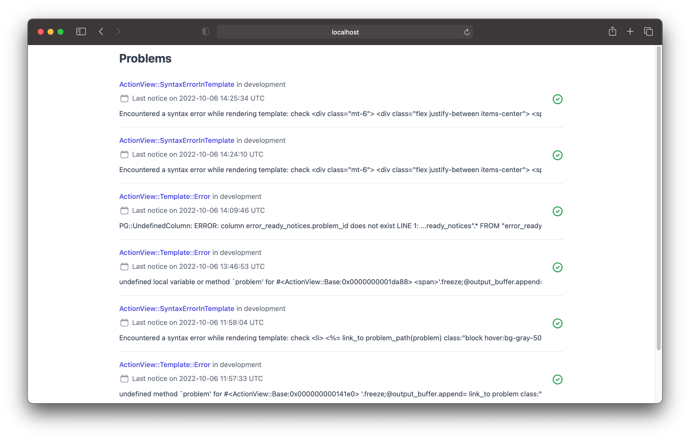

# ErrorReady
A plugin thats records errors and store them in the database you already have.



## Usage
coming soon

## Installation
Add this line to your application's Gemfile:

```ruby
gem "error_ready"
```

And then execute:
```bash
$ bundle
```

Or install it yourself as:
```bash
$ gem install error_ready
```

## Contributing
Contribution directions go here.

## License
The gem is available as open source under the terms of the [MIT License](https://opensource.org/licenses/MIT).
